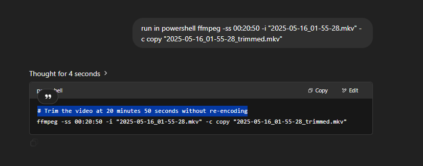
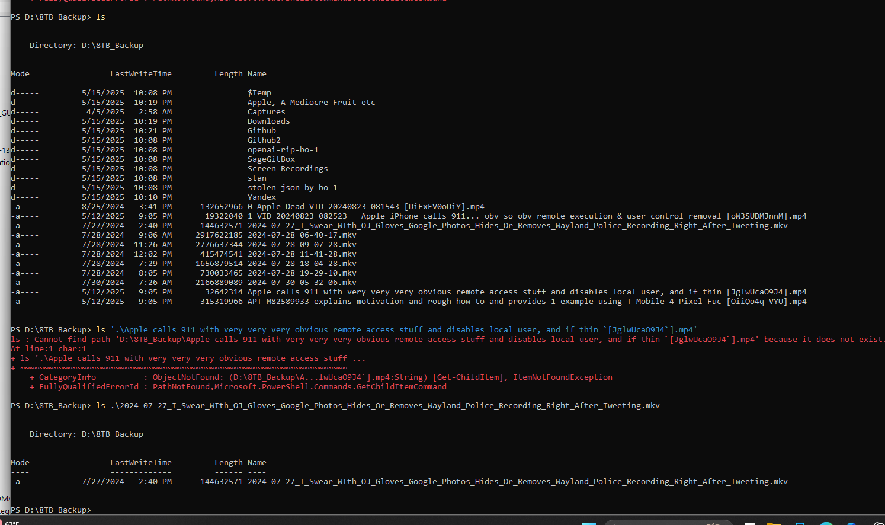

# Win_11_including_Pro_kernel_driver_RE_with_corrupted_exporer_exe_on_Bos_computers

/* Directed graph of cryptographic algorithms from Bootloader → Kernel → Drivers      */
/* Sources: Secure-Boot reqs (RSA-2048/SHA-256) :contentReference[oaicite:1]{index=1}                    */
/*          Driver‐signing SHA-2 mandate          :contentReference[oaicite:2]{index=2}                    */
/*          Kernel hash + RSA sizes support       :contentReference[oaicite:3]{index=3}                    */

digraph Win11BootCrypto {
    rankdir=TB;
    node [shape=box, style=rounded];

    Bootloader   [label="Bootloader\nbootmgfw.efi\nPKCS#7  RSA-2048  +  SHA-256"];
    Winload      [label="Winload.efi\nPKCS#7  RSA-2048  +  SHA-256"];
    Kernel       [label="Windows Kernel\nntoskrnl.exe\nRSA-2048/3072  +  SHA-256"];
    CI           [label="Code Integrity\nci.dll\nverifies RSA-SHA-2"];
    Drivers      [label="Kernel Drivers  (*.sys)\nRSA-2048/3072/4096\nSHA-256/384/512"];

    /* primary trust path */
    Bootloader   -> Winload;
    Winload      -> Kernel;
    Kernel       -> CI;
    CI           -> Drivers;

    /* direct verification branch */
    Bootloader   -> Kernel [style=dashed, label="direct verify"];

    /* convergence */
    Kernel       -> Drivers [style=dashed, label="ELAM / KCI"];
}

 