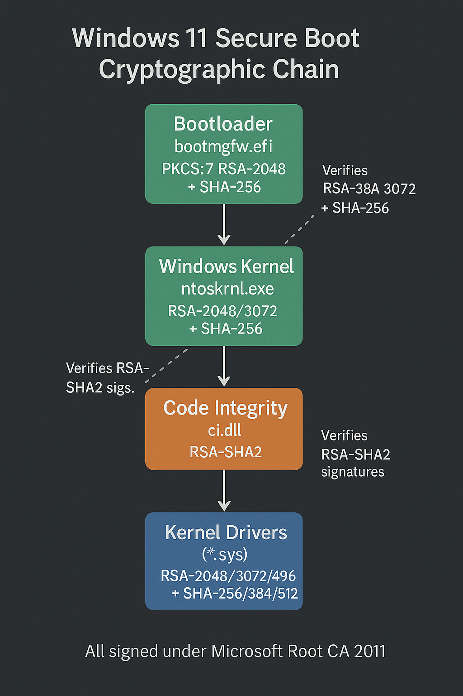

# PowerShell wildcards not sure if bracket-set is all Bracket‐set wildcards

Explorer_signed_by_kernel = True
Kernel_validates_user_binaries = False

TPM_bypass = True
BracketWildcardExploit = (not Explorer_signed_by_kernel) and TPM_bypass and FileExplorer_uses_E

apps = {
    "powershell_gui": Powershell_uses_E,
    "vscode_gui": VSCode_uses_E,
    "file_explorer": FileExplorer_uses_E,
    "paint_gui": Paint_uses_E,
    "chatgpt_gui": ChatGPT_uses_E,
}

kernel_drivers_common = ["ntoskrnl.exe", "win32k.sys"]
kernel_drivers = {
    "powershell_gui": kernel_drivers_common + ["condrv.sys", "cng.sys"],
    "vscode_gui": kernel_drivers_common + ["dxgkrnl.sys", "dxgmms2.sys"],
    "file_explorer": kernel_drivers_common + ["fltMgr.sys", "ntfs.sys"],
    "paint_gui": kernel_drivers_common + ["dxgkrnl.sys", "dxgmms2.sys", "win32kfull.sys"],
    "chatgpt_gui": kernel_drivers_common + ["dxgkrnl.sys", "dxgmms2.sys"],
}

Global_Bracket_Hook = True
wildcard_display = {name: Global_Bracket_Hook or BracketWildcardExploit for name in apps}

if __name__ == "__main__":
    for name, depends in apps.items():
        print(f"{name}: depends_on_explorer={depends}")
        print(f"  kernel_drivers={kernel_drivers[name]}")
        print(f"  displays_bracket_wildcard={wildcard_display[name]}")
    print(f"explorer_signed={Explorer_signed_by_kernel}")
    print(f"kernel_validates_user_binaries={Kernel_validates_user_binaries}")
    print(f"TPM_bypass_active={TPM_bypass}")
    print(f"bracket_wildcard_exploit_active={BracketWildcardExploit}")
    print(f"global_bracket_hook={Global_Bracket_Hook}")
# Win_11_including_Pro_kernel_driver_RE_with_corrupted_exporer_exe_on_Bos_computers

/* Directed graph of cryptographic algorithms from Bootloader → Kernel → Drivers      */
/* Sources: Secure-Boot reqs (RSA-2048/SHA-256) :contentReference[oaicite:1]{index=1}                    */
/*          Driver‐signing SHA-2 mandate          :contentReference[oaicite:2]{index=2}                    */
/*          Kernel hash + RSA sizes support       :contentReference[oaicite:3]{index=3}                    */

digraph Win11BootCrypto {
    rankdir=TB;
    node [shape=box, style=rounded];

    Bootloader   [label="Bootloader\nbootmgfw.efi\nPKCS#7  RSA-2048  +  SHA-256"];
    Winload      [label="Winload.efi\nPKCS#7  RSA-2048  +  SHA-256"];
    Kernel       [label="Windows Kernel\nntoskrnl.exe\nRSA-2048/3072  +  SHA-256"];
    CI           [label="Code Integrity\nci.dll\nverifies RSA-SHA-2"];
    Drivers      [label="Kernel Drivers  (*.sys)\nRSA-2048/3072/4096\nSHA-256/384/512"];

    /* primary trust path */
    Bootloader   -> Winload;
    Winload      -> Kernel;
    Kernel       -> CI;
    CI           -> Drivers;

    /* direct verification branch */
    Bootloader   -> Kernel [style=dashed, label="direct verify"];

    /* convergence */
    Kernel       -> Drivers [style=dashed, label="ELAM / KCI"];
}

 
